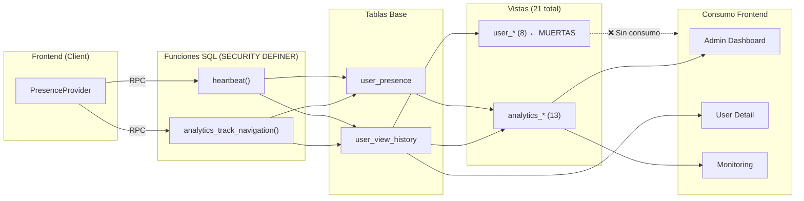

# 📊 Auditoría del Sistema de Analíticas — Seencel V2

> **Fecha:** 17 de febrero de 2026
> **Estado:** ⚠️ Requiere limpieza y unificación

---

## 1. Arquitectura Actual

### Pipeline de Datos (Tracking → DB → Views → Frontend)



### Tablas Base (2)

| Tabla | Descripción | Cols | Escritura |
|-------|-------------|------|-----------|
| `user_view_history` | Historial de vistas completo | 9 | `analytics_track_navigation()` + `heartbeat()` |
| `user_presence` | Estado realtime del usuario | 10 | `analytics_track_navigation()` + `heartbeat()` |

### Funciones SQL (2)

| Función | Tipo | Descripción |
|---------|------|-------------|
| `analytics_track_navigation(p_org_id, p_view_name, p_session_id)` | SECURITY DEFINER | Cierra vista anterior, abre nueva en `user_view_history`, actualiza `user_presence` |
| `heartbeat(p_org_id, p_status, p_session_id)` | SECURITY DEFINER | Upsert en `user_presence`, actualiza duración en `user_view_history` |

---

## 2. Inventario de Vistas

### ✅ Vistas `analytics_*` EN USO (12)

| Vista | Fuente | Consumidor | Descripción |
|-------|--------|-----------|-------------|
| `analytics_general_kpis_view` | `organizations`, `projects`, `users` | `getAdminDashboardData` | KPIs generales: total orgs, projects, users |
| `analytics_realtime_overview_view` | `user_presence` + `users` | `getAdminDashboardData` | Usuarios online ahora (5 min) |
| `analytics_user_growth_view` | `users` | `getAdminDashboardData` | Crecimiento diario de usuarios |
| `analytics_page_engagement_view` | `user_view_history` + `users` | `getAdminDashboardData` | Visitas, duración promedio, sesiones únicas por vista |
| `analytics_hourly_activity_view` | `user_presence` + `users` | `getAdminDashboardData` | Actividad por hora (últimos 7 días desde `user_presence`) |
| `analytics_top_users_view` | `users` + `user_view_history` | `getAdminDashboardData` + `getAdminUserDetail` | Usuarios top: sesiones, pageviews, tiempo total |
| `analytics_bounce_rate_view` | `user_view_history` + `users` | `getAdminDashboardData` | Tasa de rebote por sesión |
| `analytics_session_duration_view` | `user_view_history` + `users` | `getAdminDashboardData` | Duración promedio de sesión |
| `analytics_user_journeys_view` | `user_view_history` + `users` | `getAdminDashboardData` + `getUserJourneys` | Pasos del journey (últimos 7 días) |
| `analytics_at_risk_users_view` | `analytics_user_session_summary_view` | `getAdminDashboardData` | Usuarios inactivos: creados hace >7d con <3 sesiones |
| `analytics_user_session_summary_view` | `users` + `user_view_history` | Indirecta (via `at_risk`) | Resumen por usuario: sesiones, última actividad |
| `analytics_users_by_country_view` | `user_data` + `countries` | `getAdminDashboardData` | Distribución geográfica de usuarios |

### ❌ Vista `analytics_*` SIN USO (1)

| Vista | Problema |
|-------|----------|
| `analytics_session_quality_view` | **Código muerto**. No se consume en ningún lugar. Calcula `is_bounce` por sesión pero `analytics_bounce_rate_view` ya cubre esto de forma agregada. |

### ❌ Vistas `user_*` — TODAS SIN USO (8)

| Vista | Duplica a | Problema |
|-------|-----------|----------|
| `user_hourly_activity_view` | `analytics_hourly_activity_view` | **Duplicada**. Misma métrica, diferente fuente (`user_view_history` vs `user_presence`). Usa `entered_at` en vez de `last_seen_at`. |
| `user_engagement_by_view_view` | `analytics_page_engagement_view` | **Duplicada**. Misma métrica con más columnas (`avg_duration_minutes`, `last_activity_at`). |
| `user_top_performers_view` | `analytics_top_users_view` | **Duplicada**. Misma métrica con `LIMIT 8` hardcodeado. |
| `user_drop_off_view` | `analytics_at_risk_users_view` | **Duplicada**. Concepto similar (usuarios con ≤2 sesiones). |
| `user_stats_summary_view` | `analytics_general_kpis_view` | **Duplicada y expandida**. KPIs generales pero con más campos (active_users_today, avg_session_duration). |
| `user_monthly_growth_view` | `analytics_user_growth_view` | **Duplicada**. Misma métrica pero agrupada por mes en vez de día. |
| `user_presence_activity_view` | Consulta directa a `user_presence` | **Redundante**. El dashboard ya consulta `user_presence` directamente. |
| `user_acquisition_distribution_view` | Sin equivalente `analytics_*` | **Única** pero sin consumo. Distribución por fuente de adquisición. |

---

## 3. Análisis de Duplicaciones

### 3.1 Horaria: `analytics_hourly_activity_view` vs `user_hourly_activity_view`

```diff
-- analytics_hourly_activity_view (EN USO)
- Fuente: user_presence.last_seen_at (últimos 7 días)
- Mide: presencia por hora

-- user_hourly_activity_view (MUERTA)
+ Fuente: user_view_history.entered_at (histórico completo)
+ Mide: navegaciones por hora
```

> **Veredicto:** `user_hourly_activity_view` tiene una fuente más precisa (`user_view_history`), pero no se usa. La `analytics_*` usa `user_presence` que es menos granular. Cuando se migre, considerar usar `user_view_history` como fuente.

### 3.2 Engagement: `analytics_page_engagement_view` vs `user_engagement_by_view_view`

```diff
-- analytics_page_engagement_view (EN USO)
  view_name, visits, avg_duration, unique_sessions

-- user_engagement_by_view_view (MUERTA)
  view_name, session_count, avg_duration_seconds/minutes, last_activity_at
```

> **Veredicto:** `user_engagement_by_view_view` tiene campos más ricos que podrían integrarse a la analytics. Eliminar la muerta, enriquecer la viva si necesario.

### 3.3 KPIs: `analytics_general_kpis_view` vs `user_stats_summary_view`

```diff
-- analytics_general_kpis_view (EN USO)
  total_organizations, total_projects, total_users

-- user_stats_summary_view (MUERTA)  
  total_organizations, active_organizations, new_organizations_this_month,
  total_users, active_users_now, active_users_today, new_users_this_month,
  total_projects, new_projects_this_month, sessions_today, avg_session_duration
```

> **Veredicto:** `user_stats_summary_view` es significativamente más completa. El dashboard actual obtiene estos datos extra de vistas separadas (`analytics_realtime_overview_view`, etc.). Consolidar podría reducir queries pero la vista monolítica tendría peor performance.

---

## 4. Bug Crítico: Tracking detenido desde el 29/01/2026

### Síntoma

- Usuarios nuevos no generan actividad
- Usuarios viejos activos no registran actividad desde el 29 de enero
- Los heartbeats SÍ actualizan `user_presence` (los usuarios aparecen online)
- Pero `user_view_history` no recibe nuevas filas

### Causa Raíz Probable

El `PresenceProvider` (línea 266) tiene un guard:

```tsx
// src/providers/presence-provider.tsx:265-267
if (!userId || !activeOrgId || !sessionIdRef.current) return;
```

Si `activeOrgId` del store Zustand es `null`, **todo el tracking de navegación se aborta silenciosamente**. El heartbeat tiene el mismo guard (línea 232).

Pero el heartbeat SÍ funciona (usuarios aparecen online) → por lo tanto, `activeOrgId` no es null.

### Hipótesis alternativas

1. **El `usePathname()` retorna la misma ruta:** Si la primera navegación setea `lastPathRef.current` y las siguientes comparaciones pasan (`pathname === lastPathRef.current`), el tracking no se dispara. Esto podría pasar si el locale cambió en la URL pero el pathname no.

2. **Error silencioso en la RPC:** El `catch` en `trackNavigation()` (línea 284-287) solo hace `console.error`, NO re-lanza. Si `analytics_track_navigation` falla (por ejemplo, por un constraint violation, una columna faltante, o un error de permisos), el error se traga silenciosamente. **Esto es lo más probable**.

3. **Cambio en `user_view_history` o en la función SQL:** Si se modificó la tabla (ej: se agregó una columna NOT NULL sin default) o la función SQL se modificó/recreó mal alrededor del 29/01, las inserciones fallarían silenciosamente.

### Diagnóstico recomendado

1. **Verificar consola del browser:** Abrir DevTools → Console y navegar por la app. Si aparece `[Presence] Navigation tracking failed:` con algún error, eso confirma hipótesis 2.
2. **Verificar datos en `user_view_history`:** Ejecutar en Supabase:
   ```sql
   SELECT entered_at, user_id, view_name 
   FROM user_view_history 
   ORDER BY entered_at DESC 
   LIMIT 10;
   ```
   Si la última entrada es del 29/01, confirma que la inserción dejó de funcionar.
3. **Probar RPC manualmente:** Desde el SQL Editor de Supabase:
   ```sql
   SELECT analytics_track_navigation(
     'tu-org-id'::uuid, 
     'Test View', 
     gen_random_uuid()
   );
   ```
   Si falla, el error dirá exactamente qué se rompió.

---

## 5. Consumo en Frontend

### `getAdminDashboardData()` — [admin/queries.ts](file:///c:/Users/Usuario/Seencel/seencel-v2/src/features/admin/queries.ts#L117-L282)

Consulta **12 vistas analytics** en paralelo + consultas directas a `user_presence` y `users`. Este es el consumidor principal.

### `getAdminUserDetail()` — [admin/queries.ts](file:///c:/Users/Usuario/Seencel/seencel-v2/src/features/admin/queries.ts#L918-L1021)

Consulta `user_view_history` y `user_presence` **directamente** (no usa vistas). También consulta `analytics_top_users_view` para stats agregadas.

### `getUserJourneys()` — [admin/queries.ts](file:///c:/Users/Usuario/Seencel/seencel-v2/src/features/admin/queries.ts#L798)

Consulta `analytics_user_journeys_view` para la vista de journeys. Se usa en el panel de Admin.

### `organization_activity_logs_view`

> ⚠️ **NO es analítica de plataforma.** Es auditoría de acciones CRUD por organización (quién hizo qué). Se usa en widgets de actividad de equipo y en configuraciones de organización. NO debe unificarse con las analytics.

### `PresenceProvider` — [providers/presence-provider.tsx](file:///c:/Users/Usuario/Seencel/seencel-v2/src/providers/presence-provider.tsx)

Componente client que:
1. Envía heartbeats cada 45s (`heartbeat()` RPC)
2. Trackea navegación en cada cambio de pathname (`analytics_track_navigation()` RPC)
3. Maneja cambios de visibilidad (tab switching)

---

## 6. Problemas Detectados

### P1: 🟥 8 vistas `user_*` son código muerto

**No se usan en ningún lugar del frontend.** Ocupan espacio en el schema y generan confusión sobre qué es "real" y qué es legacy.

### P2: 🟥 `analytics_session_quality_view` es código muerto

Vista `analytics_*` que no se consume en ningún lado. La funcionalidad de bounce ya la cubre `analytics_bounce_rate_view`.

### P3: 🟨 Naming inconsistente

Hay vistas que empiezan con `user_*` y son analíticas de plataforma (ej: `user_top_performers_view`), lo cual genera confusión con tablas/vistas que son del dominio "usuario" propiamente dicho (ej: `users_public_profile_view`).

### P4: 🟨 `analytics_hourly_activity_view` usa fuente subóptima

Usa `user_presence.last_seen_at` en vez de `user_view_history.entered_at`. La presencia refleja "cuándo estuvo online" pero la view_history refleja "cuándo navegó", que es más precisa para una métrica de actividad horaria.

### P5: 🟥 Tracking silenciosamente roto desde ~29/01

Los errores de tracking se tragan con `console.error` sin ningún fallback ni alerta. Esto hizo que el bug pasara desapercibido durante 19 días.

### P6: 🟨 `analytics_at_risk_users_view` depende de vista intermedia

Depende de `analytics_user_session_summary_view`, creando una cadena de dependencias. No es necesariamente malo, pero agrega complejidad.

---

## 7. Plan de Acción Propuesto

### Fase 1: Limpieza DB (SQL scripts)

| Acción | Detalle |
|--------|---------|
| **DROP** 8 vistas `user_*` | `user_hourly_activity_view`, `user_engagement_by_view_view`, `user_top_performers_view`, `user_drop_off_view`, `user_stats_summary_view`, `user_monthly_growth_view`, `user_presence_activity_view`, `user_acquisition_distribution_view` |
| **DROP** 1 vista `analytics_*` | `analytics_session_quality_view` (sin uso) |
| Total eliminadas | **9 vistas** |
| Vistas que quedan | **12 vistas `analytics_*`** |

### Fase 2: Mejora de vista existente

| Vista | Mejora |
|-------|--------|
| `analytics_hourly_activity_view` | Cambiar fuente de `user_presence` a `user_view_history` para mayor precisión |

### Fase 3: Fix del bug de tracking

| Acción | Detalle |
|--------|---------|
| Diagnosticar causa exacta | Verificar consola y DB según pasos de sección 4 |
| Mejorar error handling | Agregar telemetría visible cuando el tracking falla (no solo `console.error`) |

---

## 8. Vista Resultante Final (Post-Limpieza)

| Vista | Propósito |
|-------|-----------|
| `analytics_general_kpis_view` | KPIs generales de plataforma |
| `analytics_realtime_overview_view` | Usuarios online ahora |
| `analytics_user_growth_view` | Crecimiento diario de registros |
| `analytics_page_engagement_view` | Métricas de engagement por vista |
| `analytics_hourly_activity_view` | Distribución horaria de actividad |
| `analytics_top_users_view` | Ranking de usuarios por uso |
| `analytics_bounce_rate_view` | Tasa de rebote |
| `analytics_session_duration_view` | Duración promedio de sesión |
| `analytics_user_journeys_view` | Pasos del journey por sesión |
| `analytics_at_risk_users_view` | Usuarios en riesgo de abandono |
| `analytics_user_session_summary_view` | Resumen de sesiones por usuario |
| `analytics_users_by_country_view` | Distribución geográfica |

> **12 vistas**, todas con naming consistente `analytics_*`, sin duplicaciones, sin código muerto.
