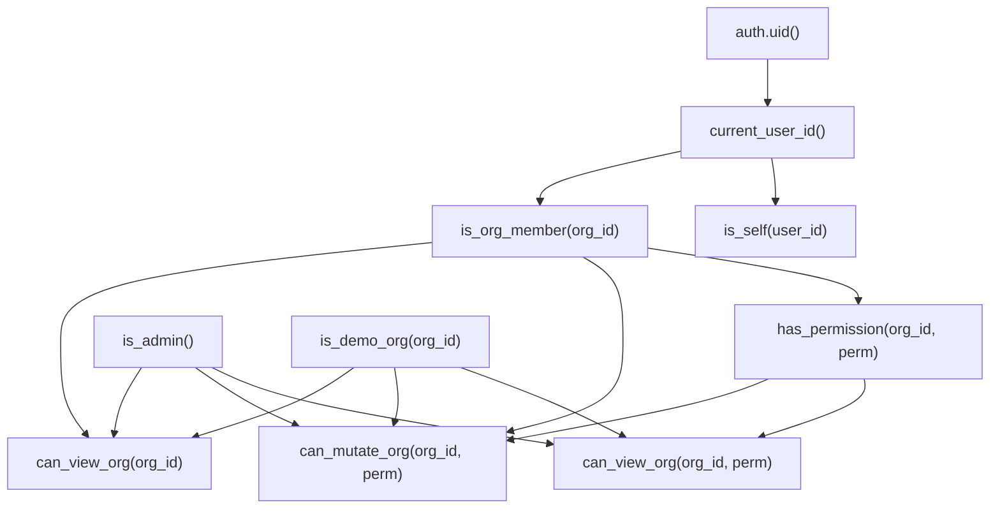

# Auditoría: Arquitectura RLS y Modelo Multi-Actor

> **Fecha**: 2026-02-18
> **Alcance**: Funciones helper RLS, políticas existentes, propuesta multi-actor
> **Objetivo**: Evaluar si la arquitectura actual soporta la incorporación de nuevos tipos de actores (colaboradores externos, clientes, empleados) sin reescribir policies.

---

## 1. Estado Actual

### 1.1 Funciones Helper Core

El sistema de permisos se basa en **7 funciones SECURITY DEFINER** que forman una cadena de dependencias:



| Función | Tipo | Qué hace |
|---------|------|----------|
| `current_user_id()` | STABLE, DEFINER | `users.id` donde `auth_id = auth.uid()` |
| `is_admin()` | STABLE, DEFINER | Existe en `admin_users` por `auth_id` |
| `is_self(user_id)` | STABLE, DEFINER | `user_id = current_user_id()` |
| `is_org_member(org_id)` | STABLE, DEFINER | Existe en `organization_members` activo |
| `is_demo_org(org_id)` | STABLE, DEFINER | `organizations.is_demo = true` |
| `has_permission(org_id, perm)` | STABLE, DEFINER | JOIN `om → roles → role_permissions → permissions` |
| `can_view_org(org_id)` | VOLATILE, DEFINER | `is_admin() OR is_demo_org() OR is_org_member()` |
| `can_view_org(org_id, perm)` | VOLATILE, DEFINER | `is_admin() OR is_demo_org() OR (is_org_member() AND has_permission())` |
| `can_mutate_org(org_id, perm)` | STABLE, DEFINER | `is_admin() OR (!demo AND is_org_member() AND has_permission())` |

### 1.2 Uso en Policies (361 totales)

| Función | Ocurrencias directas en RLS |
|---------|----------------------------|
| `is_admin()` | **174** |
| `can_mutate_org()` | **120** |
| `can_view_org()` | **53** |
| `has_permission()` | **0** (solo internamente via `can_view_org`/`can_mutate_org`) |
| `is_self()` | ~15 |
| `is_org_member()` | **0** (solo internamente) |

### 1.3 Patrón RLS Dominante

El 95% de las tablas de la aplicación usan este patrón:

```sql
-- SELECT
can_view_org(organization_id, 'feature.view')

-- INSERT / UPDATE / DELETE
can_mutate_org(organization_id, 'feature.manage')
```

> [!IMPORTANT]
> **Las policies NUNCA llaman `has_permission()` directamente.** Siempre pasan por `can_view_org` o `can_mutate_org`. Esto es un diseño correcto — las policies son simples, la inteligencia está en los helpers.

### 1.4 Tablas de Actores Existentes

| Tabla | Vinculación | Clave | Tiene `user_id` |
|-------|-------------|-------|-----------------|
| `organization_members` | Org | `user_id` → `users.id` | ✅ |
| `organization_external_actors` | **Solo org** | `user_id` → `users.id` | ✅ |
| `project_clients` | Proyecto | `contact_id` → `contacts.id` | ❌ (usa contacto) |

> [!WARNING]
> `project_clients` **NO tiene `user_id`**. Vincula `contact_id`, que es un contacto de la organización (puede o no tener un `linked_user_id`). Esto es un gap importante para RLS project-level de clientes.

### 1.5 Vinculación Proyecto-Actor: No Existe

No hay tabla que vincule `organization_external_actors` a proyectos específicos. La tabla actual solo tiene `organization_id`. Esto significa que un actor externo tiene acceso a **toda la organización o nada** — no se puede restringir a un proyecto.

---

## 2. Evaluación de la Propuesta

### 2.1 Lo Que Propone el Usuario

1. Modificar `can_view_org()` para incluir external actors
2. Crear `can_view_project(project_id)` para validar acceso por proyecto
3. Mantener `can_mutate_org()` solo para miembros
4. Mantener `has_permission()` solo para miembros

### 2.2 Análisis Crítico

#### ✅ Fortalezas
- **No multiplica policies**: correcto, las 361 políticas existentes no necesitan reescribirse
- **Inteligencia en helpers**: correcto, el punto de extensión correcto
- **Escalable**: agregar un actor_type solo requiere modificar helpers, no policies

#### ⚠️ Riesgos y Gaps

**GAP 1: `can_view_org()` es demasiado amplia para external actors**

Si modificamos `can_view_org()` para incluir external actors, estos verían **TODAS las tablas** que usan `can_view_org()`. Un contador externo vería materiales, tareas de obra, subcontratos — todo. Esto probablemente no es lo deseado.

**Solución propuesta**: No modificar `can_view_org()`. En su lugar, crear una nueva función `can_view_org_extended(org_id)` que incluya external actors, y usarla **solo** en las tablas que deben ser visibles para actores externos. Pero esto viola el principio de "no multiplicar".

**Solución alternativa (mejor)**: Modificar `can_view_org()` pero agregar un **scope de permiso** dentro de la propia función. Los external actors tendrían permisos implícitos basados en su `actor_type`.

**GAP 2: No existe vinculación project-level para external actors**

La tabla `organization_external_actors` solo tiene `organization_id`. Para implementar `can_view_project()`, necesitamos:
- Una tabla `project_external_actors` o similar
- O un array JSONB de `project_ids` en `organization_external_actors`
- O una tabla de vinculación genérica `project_actors`

**GAP 3: `project_clients` usa `contact_id`, no `user_id`**

Para que un cliente pueda autenticarse y acceder a datos de su proyecto via RLS, necesitamos resolver `user_id` → `contact_id` → `project_clients`. La cadena sería:

```
auth.uid() → users.auth_id → users.id → contacts.linked_user_id → project_clients.contact_id
```

Esto implica un JOIN de 3-4 niveles dentro de `can_view_project()`, costoso para evaluarse en cada row.

**GAP 4: Performance de helpers con JOINs**

Actualmente `has_permission()` hace un JOIN de 4 tablas. Si `can_view_project()` agrega JOINs para external_actors y clients, el costo se multiplica. Cada row evaluada en un SELECT ejecuta la función.

**Mitigación**: Usar `SET (rows = 1)` en las funciones, índices compuestos, y considerar `STABLE` para cacheo por transacción.

---

## 3. Arquitectura Propuesta

### 3.1 Modelo de Datos: Tabla Unificada de Acceso

En lugar de múltiples tablas de vinculación por actor_type, propongo **una tabla unificada de acceso a proyecto**:

```sql
CREATE TABLE project_access (
    id UUID PRIMARY KEY DEFAULT gen_random_uuid(),
    project_id UUID NOT NULL REFERENCES projects(id),
    organization_id UUID NOT NULL REFERENCES organizations(id),
    user_id UUID NOT NULL REFERENCES users(id),
    access_type TEXT NOT NULL, -- 'member', 'external', 'client', 'employee'
    access_level TEXT NOT NULL DEFAULT 'viewer', -- 'viewer', 'editor', 'admin'
    granted_by UUID REFERENCES organization_members(id),
    is_active BOOLEAN NOT NULL DEFAULT true,
    created_at TIMESTAMPTZ NOT NULL DEFAULT now(),
    updated_at TIMESTAMPTZ NOT NULL DEFAULT now(),
    UNIQUE(project_id, user_id) -- Un usuario, un acceso por proyecto
);
```

> [!TIP]
> **Ventaja clave**: `can_view_project()` solo necesita hacer un `EXISTS` en una tabla con un índice compuesto `(project_id, user_id, is_active)`. Sin JOINs.

### 3.2 Funciones Helper: Evolución

#### Funciones que NO cambian:
- `is_admin()` — sigue igual
- `is_self()` — sigue igual
- `current_user_id()` — sigue igual
- `is_demo_org()` — sigue igual
- `has_permission()` — sigue igual (solo para miembros)

#### Funciones que se MODIFICAN:

**`can_view_org(org_id)` — Extender para external actors a nivel org**

```sql
CREATE OR REPLACE FUNCTION can_view_org(p_organization_id uuid)
RETURNS boolean
LANGUAGE sql STABLE SECURITY DEFINER
SET search_path TO 'public'
AS $$
  SELECT
    public.is_admin()
    OR public.is_demo_org(p_organization_id)
    OR public.is_org_member(p_organization_id)
    OR EXISTS (
      SELECT 1 FROM organization_external_actors ea
      WHERE ea.organization_id = p_organization_id
        AND ea.user_id = public.current_user_id()
        AND ea.is_active = true
        AND ea.is_deleted = false
    );
$$;
```

**`can_view_org(org_id, perm)` — Misma extensión**

```sql
CREATE OR REPLACE FUNCTION can_view_org(p_organization_id uuid, p_permission_key text)
RETURNS boolean
LANGUAGE sql STABLE SECURITY DEFINER
SET search_path TO 'public'
AS $$
  SELECT
    public.is_admin()
    OR public.is_demo_org(p_organization_id)
    OR (
      public.is_org_member(p_organization_id)
      AND public.has_permission(p_organization_id, p_permission_key)
    )
    OR EXISTS (
      SELECT 1 FROM organization_external_actors ea
      WHERE ea.organization_id = p_organization_id
        AND ea.user_id = public.current_user_id()
        AND ea.is_active = true
        AND ea.is_deleted = false
    );
$$;
```

> [!CAUTION]
> **Decisión crítica**: ¿Los external actors deberían pasar por `has_permission`? Si sí, necesitan roles. Si no, ven todo lo que un miembro con permisos vería. La propuesta actual les da `can_view` sin `has_permission` — ven tablas pero sin chequeo granular. Esto puede ser demasiado permisivo.

#### Funciones NUEVAS:

**`can_view_project(project_id)` — Acceso project-level**

```sql
CREATE OR REPLACE FUNCTION can_view_project(p_project_id uuid)
RETURNS boolean
LANGUAGE sql STABLE SECURITY DEFINER
SET search_path TO 'public'
AS $$
  SELECT
    public.is_admin()
    OR EXISTS (
      -- Miembro de la org que posee el proyecto
      SELECT 1 FROM projects p
      JOIN organization_members om ON om.organization_id = p.organization_id
      WHERE p.id = p_project_id
        AND om.user_id = public.current_user_id()
        AND om.is_active = true
    )
    OR EXISTS (
      -- Acceso explícito al proyecto (externos, clientes, empleados)
      SELECT 1 FROM project_access pa
      WHERE pa.project_id = p_project_id
        AND pa.user_id = public.current_user_id()
        AND pa.is_active = true
    );
$$;
```

**`can_mutate_project(project_id, perm)` — Escritura project-level**

```sql
CREATE OR REPLACE FUNCTION can_mutate_project(p_project_id uuid, p_permission_key text)
RETURNS boolean
LANGUAGE sql STABLE SECURITY DEFINER
SET search_path TO 'public'
AS $$
  SELECT
    public.is_admin()
    OR EXISTS (
      SELECT 1 FROM projects p
      WHERE p.id = p_project_id
        AND public.can_mutate_org(p.organization_id, p_permission_key)
    )
    OR EXISTS (
      SELECT 1 FROM project_access pa
      WHERE pa.project_id = p_project_id
        AND pa.user_id = public.current_user_id()
        AND pa.is_active = true
        AND pa.access_level IN ('editor', 'admin')
    );
$$;
```

### 3.3 Impacto en Policies Existentes

| Escenario | Policies afectadas | Acción |
|-----------|-------------------|--------|
| External actors ven datos org-level | **0 cambios** | `can_view_org()` se expande internamente |
| Clientes ven datos de su proyecto | **0 cambios** si tablas ya tienen `project_id` | Agregar policy alternativa con `can_view_project()` |
| Tablas sin `project_id` | **Sin impacto** | Clientes no las ven |
| `can_mutate_org` | **0 cambios** | Solo miembros siguen mutando |

### 3.4 Tabla `can_view_org` con External Actors — Riesgos de Sobre-exposición

Si expandimos `can_view_org()`, los external actors verían:

| Tabla | ¿Debería ver un externo? |
|-------|--------------------------|
| `projects` | ✅ Sí (los suyos) |
| `construction_tasks` | ⚠️ Depende del tipo |
| `client_payments` | ❌ Probablemente no |
| `materials` | ❌ Probablemente no |
| `organization_wallets` | ❌ No |
| `general_costs` | ❌ No |
| `organization_members` | ⚠️ Solo info básica |

> [!WARNING]
> **Riesgo principal**: Expandir `can_view_org()` sin discriminar es peligroso. Un actor externo tipo "director de obra" debería ver tareas de construcción de un proyecto específico, pero NO datos financieros de la organización.

### 3.5 Alternativa: No Tocar `can_view_org()`

En vez de expandir `can_view_org()`, NO modificarla y agregar policies paralelas:

```sql
-- Tabla construction_tasks: mantener policy existente + agregar nueva
CREATE POLICY "EXTERNOS VEN TAREAS DE SUS PROYECTOS" ON construction_tasks
FOR SELECT USING (
  can_view_project(project_id)
);
```

Esto requiere agregar ~10-15 policies nuevas solo en tablas relevantes, en vez de expandir la función base. Es más trabajo inicial pero más seguro.

---

## 4. Decisiones Pendientes (Requieren Input del Usuario)

### Decisión 1: ¿Expandir `can_view_org()` o agregar policies paralelas?

| Opción | Pros | Contras |
|--------|------|---------|
| **A: Expandir `can_view_org()`** | 0 cambios en policies, simple | Sobre-exposición de datos |
| **B: Policies paralelas con `can_view_project()`** | Granularidad fina | ~15 policies nuevas |
| **C: Híbrido** — `can_view_org()` para datos org-level + `can_view_project()` para datos project-level | Balance | Complejidad moderada |

**Recomendación**: **Opción C (Híbrido)**.
- `can_view_org()` se expande solo para tablas que son genuinamente org-level (org_members, org_preferences)
- `can_view_project()` se usa como policy adicional en tablas con `project_id`
- `can_mutate_org()` NO se toca — solo miembros mutan

### Decisión 2: ¿Tabla `project_access` o vinculación por tipo?

| Opción | Pros | Contras |
|--------|------|---------|
| **A: `project_access` unificada** | Una sola tabla, simple para `can_view_project()` | Duplica info de miembros |
| **B: Consulta distribuida** (om + ea + pc por separado) | No duplica | `can_view_project()` con 3+ EXISTS, costoso |

**Recomendación**: **Opción A** (`project_access`). Los miembros se auto-insertan via trigger cuando se vinculan a un proyecto. El beneficio de performance es significativo.

### Decisión 3: ¿Los external actors necesitan roles/permisos?

| Opción | Pros | Contras |
|--------|------|---------|
| **A: Sin roles** (el `access_level` en `project_access` es suficiente) | Simple, rápido de implementar | Menos granular que miembros |
| **B: Con roles propios** (`external_roles`) | Consistente con el sistema | Complejidad, más tablas |

**Recomendación**: **Opción A** inicialmente. Tres niveles (`viewer`, `editor`, `admin`) cubren el 95% de casos. Si en el futuro se necesitan roles granulares, se puede agregar `role_id` a `project_access`.

### Decisión 4: ¿Usar `SECURITY DEFINER` en todas las funciones nuevas?

**Sí, obligatorio.** Las funciones helper acceden a tablas con RLS activo. Sin `SECURITY DEFINER`, la función heredaría los permisos del caller, creando recursión RLS infinita.

---

## 5. Performance

### 5.1 Costo Actual

```
can_mutate_org(org_id, perm)
  → is_admin()          -- 1 query simple (admin_users, auth.uid())
  → is_demo_org()       -- 1 query simple
  → is_org_member()     -- 1 query (organization_members)
  → has_permission()    -- 1 query con 4 JOINs
```

Total: **4 queries por row evaluada**. Con índices apropiados, esto es <1ms.

### 5.2 Costo con `can_view_project()`

```
can_view_project(project_id)
  → is_admin()          -- 1 query
  → org member check    -- 1 query (projects JOIN om)
  → project_access      -- 1 query (EXISTS con índice)
```

Total: **3 queries por row**. Con índice `(project_id, user_id, is_active)`, rendimiento comparable al actual.

### 5.3 Índices Recomendados

```sql
-- project_access
CREATE INDEX idx_project_access_lookup
ON project_access(project_id, user_id)
WHERE is_active = true;

-- organization_external_actors (si se expande can_view_org)
CREATE INDEX idx_external_actors_org_user
ON organization_external_actors(organization_id, user_id)
WHERE is_active = true AND is_deleted = false;
```

---

## 6. Roadmap de Implementación

### Fase 1: Infraestructura (Sin impacto visible)
1. Crear tabla `project_access` con RLS, triggers e índices
2. Crear funciones `can_view_project()` y `can_mutate_project()`
3. Agregar índice en `organization_external_actors`

### Fase 2: Migración de External Actors
4. Popular `project_access` con datos existentes de `organization_external_actors`
5. Expandir `can_view_org()` para incluir external actors a nivel org
6. Agregar policies `can_view_project()` en tablas clave

### Fase 3: Portal de Cliente (Futuro)
7. Vincular `project_clients` → `contacts` → `users` → `project_access`
8. Implementar `can_view_project()` policies en tablas de cliente

### Fase 4: Empleados / Obreros (Futuro)
9. Agregar `access_type = 'employee'` en `project_access`
10. NO requiere nuevas funciones ni policies

---

## 7. Resumen Ejecutivo

| Aspecto | Estado Actual | Recomendación |
|---------|---------------|---------------|
| **Funciones helper** | ✅ Bien diseñadas, centralizadas | Expandir `can_view_org`, crear `can_view_project` |
| **Policies** | ✅ Simples, delegan a helpers | NO reescribir, agregar policies paralelas |
| **Performance** | ✅ Aceptable (4 queries/row) | Índices en nuevas tablas |
| **External actors** | ⚠️ Solo org-level | Necesitan vinculación project-level |
| **Clientes** | ❌ Sin acceso RLS propio | Necesitan `project_access` + `can_view_project` |
| **Escalabilidad** | ⚠️ Solo 1 actor_type (member) | `project_access` unificada soporta N tipos |
| **Security** | ✅ SECURITY DEFINER correctamente usado | Mantener en funciones nuevas |

> [!IMPORTANT]
> **Veredicto**: La propuesta del usuario es **correcta en principio** pero necesita refinamiento. El gap más crítico es la **sobre-exposición** al expandir `can_view_org()` sin discriminar. La solución híbrida (org-level + project-level con tabla unificada) es la arquitectura más sólida y escalable.

---

## 8. PENDIENTE: RLS Paralelas para Client Scoping (Sección 3 del script 018)

> **Estado**: ⏳ Pendiente de análisis y ejecución
> **Archivo**: `DB/018_client_scoped_project_access.sql` — Sección 3
> **Contexto**: Se agregó `client_id` a `project_access` y se creó `can_view_client_data()`. Falta ejecutar las 4 policies paralelas.

### Lo que ya se hizo (✅)
- `ALTER TABLE project_access ADD COLUMN client_id` → ejecutado
- `CREATE FUNCTION can_view_client_data()` → ejecutado
- `DROP VIEW + CREATE VIEW project_access_view` con `client_id` y `client_name` → ejecutado

### Lo que falta (⏳) — 4 RLS Policies paralelas

Estas policies agregan **SELECT scoping por cliente** en tablas financieras. Son **paralelas** (se suman con OR a las existentes, no reemplazan).

| Policy | Tabla | Lógica |
|--------|-------|--------|
| `client_commitments_client_scoped_select` | `client_commitments` | `can_view_client_data(project_id, client_id)` |
| `client_payments_client_scoped_select` | `client_payments` | Si `client_id` NOT NULL → `can_view_client_data()`, sino → `can_view_project()` |
| `client_payment_schedule_client_scoped_select` | `client_payment_schedule` | Via JOIN a `client_commitments` → `can_view_client_data()` |
| `quotes_client_scoped_select` | `quotes` | Resuelve `contacts.id` → `project_clients.id` → `can_view_client_data()` |

### Notas para el análisis
- Verificar que las policies existentes en estas tablas no entren en conflicto
- Evaluar performance del JOIN en `client_payment_schedule` (via commitment)
- La policy de `quotes` es la más compleja: resuelve contact_id → project_client_id
- **Ninguna de estas policies afecta a organization_members** — `can_view_client_data()` retorna TRUE para miembros vía OR
