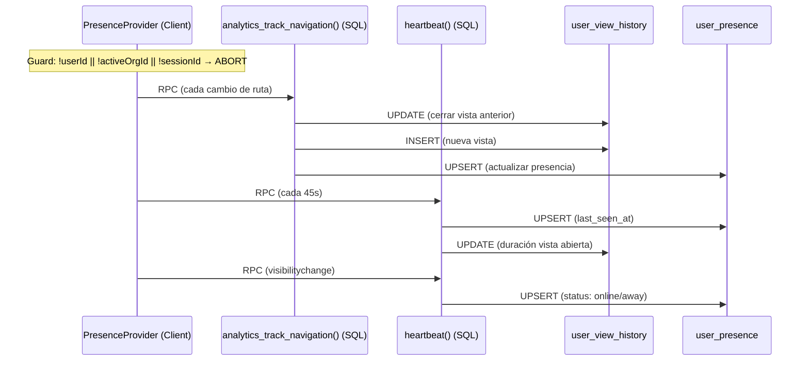

# 🔍 Auditoría: Pipeline de Tracking (user_view_history + user_presence)

> **Fecha:** 17 de febrero de 2026
> **Estado:** 🟥 Bugs críticos encontrados

---

## 1. Arquitectura del Pipeline



---

## 2. Componentes del Pipeline

### 2.1 PresenceProvider — [presence-provider.tsx](file:///c:/Users/Usuario/Seencel/seencel-v2/src/providers/presence-provider.tsx)

| Effect | Función | Trigger | Guard |
|--------|---------|---------|-------|
| Heartbeat | `heartbeat` RPC | Cada 45s + mount | `!userId \|\| !activeOrgId \|\| !sessionId` |
| Navigation | `analytics_track_navigation` RPC | Cambio de `pathname` | `!userId \|\| !activeOrgId \|\| !sessionId` + `pathname === lastPath` |
| Visibility | `heartbeat` RPC | `visibilitychange` | `!userId \|\| !activeOrgId \|\| !sessionId` |

**Montaje:** En `layout-switcher.tsx`, solo se monta si `user?.id` existe. Recibe `userId` como prop. `activeOrgId` viene del store Zustand via `useOrganization()`.

### 2.2 Funciones SQL

#### `analytics_track_navigation(p_org_id, p_view_name, p_session_id)` — SECURITY DEFINER

```
1. Resolve user_id from auth.uid()
2. UPDATE user_view_history → cerrar vista anterior (exited_at, duration_seconds)
3. INSERT user_view_history → nueva vista (user_id, organization_id, session_id, view_name)
4. UPSERT user_presence → org_id, session_id, current_view, status='online'
```

#### `heartbeat(p_org_id, p_status, p_session_id)` — SECURITY DEFINER

```
1. Resolve user_id from auth.uid()
2. UPSERT user_presence → org_id, session_id, last_seen_at, status
3. UPDATE user_view_history → actualizar duración de vista abierta (si session_id != null)
```

### 2.3 Tablas

#### `user_view_history`

| Columna | Tipo | Nullable | Notas |
|---------|------|----------|-------|
| id | uuid | ✗ | PK |
| user_id | uuid | ✗ | FK → users.id |
| **organization_id** | uuid | **✓** | FK → organizations.id — **nullable, OK** |
| view_name | text | ✗ | |
| entered_at | timestamptz | ✗ | |
| exited_at | timestamptz | ✓ | |
| duration_seconds | int4 | ✓ | |
| session_id | uuid | ✓ | |

#### `user_presence`

| Columna | Tipo | Nullable | Notas |
|---------|------|----------|-------|
| user_id | uuid | ✗ | PK, FK → users.id |
| **org_id** | uuid | **✗** | ⚠️ **NOT NULL — PROBLEMA** |
| last_seen_at | timestamptz | ✗ | |
| status | text | ✗ | |
| session_id | uuid | ✓ | |
| current_view | text | ✓ | |
| updated_from | text | ✓ | |
| updated_at | timestamptz | ✓ | |

---

## 3. Bugs y Problemas Encontrados

### 🟥 BUG 1: `user_presence.org_id` es NOT NULL — bloquea usuarios sin organización

**La tabla `user_presence` tiene `org_id NOT NULL`**, pero los usuarios nuevos en onboarding no tienen organización.

**Impacto:**
- La función `heartbeat()` hace `INSERT INTO user_presence (org_id, ...)` con el valor de `p_org_id`
- Si `p_org_id` es NULL → **violación de constraint NOT NULL** → error silencioso
- La función `analytics_track_navigation()` hace lo mismo

**Pero esto no llega a ejecutarse** porque el frontend ya corta antes con el guard `!activeOrgId`.

**Fix:** Hacer `org_id` **nullable** en `user_presence` para soportar usuarios sin organización. Actualizar las funciones SQL para aceptar null.

---

### 🟥 BUG 2: Guard `!activeOrgId` bloquea TODO el tracking

**Las 3 funciones en PresenceProvider** tienen el mismo guard:

```tsx
if (!userId || !activeOrgId || !sessionIdRef.current) return;
```

`activeOrgId` viene de `useOrganization()` → `useOrganizationStore(state => state.activeOrgId)`.

El store se hydrata en `OrganizationStoreHydrator` con el valor de `getUserOrganizations()`:

```tsx
const activeOrgId = pref?.last_organization_id || null;
```

**Escenarios donde `activeOrgId` es `null`:**
1. ✅ Usuario nuevo sin organización (onboarding)
2. ✅ Usuario que nunca seleccionó una org (no tiene `user_preferences.last_organization_id`)
3. ✅ Usuario cuyo `last_organization_id` apunta a una org eliminada/inactiva
4. ⚠️ **Race condition:** El store se hydrata en Phase 1 (instant) con `activeOrgId`, pero Phase 2 (lazy) trae el resto. Si Phase 1 tiene `null` temporalmente, el `useEffect` se ejecuta con null → no trackea → y luego cuando Phase 2 llega, el `useEffect` no se re-ejecuta porque `pathname` no cambió

**Este es posiblemente el bug del 29 de enero:** Si alrededor de esa fecha se hizo un cambio en el flujo de hydratación del store, onboarding, o en cómo se resuelve `last_organization_id`, eso explicaría por qué dejó de funcionar.

**Fix:** El tracking NO debería depender de `activeOrgId` para funcionar. `organization_id` es dato contextual opcional, no un requisito para trackear actividad. Un usuario puede navegar sin estar en una organización (Hub, Perfil, Academy, etc.).

---

### 🟨 BUG 3: Duplicación de lógica entre `heartbeat()` y `analytics_track_navigation()`

Ambas funciones actualizan `user_presence` con UPSERT casi idéntico:

```sql
-- analytics_track_navigation (parte C)
INSERT INTO user_presence (user_id, org_id, session_id, last_seen_at, current_view, status, updated_from)
VALUES (v_user_id, p_org_id, p_session_id, now(), p_view_name, 'online', 'navigation')
ON CONFLICT (user_id) DO UPDATE SET ...

-- heartbeat
INSERT INTO user_presence (user_id, org_id, session_id, last_seen_at, status, updated_from)
VALUES (v_user_id, p_org_id, p_session_id, now(), p_status, 'heartbeat')
ON CONFLICT (user_id) DO UPDATE SET ...
```

**Diferencia:** `analytics_track_navigation` también setea `current_view`, `heartbeat` no.

**Problema:** Ambas hacen UPSERT con `updated_from` diferente (`'navigation'` vs `'heartbeat'`), lo cual es correcto para diagnosticar el origen. Pero duplican la lógica del UPSERT.

**Mitigación:** Que `analytics_track_navigation` llame internamente a `heartbeat()` para el upsert de presencia, y luego solo actualize `current_view`. Pero esto agrega una llamada anidada. **No es crítico, solo deuda técnica.**

---

### 🟨 BUG 4: Naming inconsistente entre tablas

| Tabla | Columna |
|-------|---------|
| `user_view_history` | `organization_id` |
| `user_presence` | `org_id` |

La misma referencia a organizaciones tiene nombres distintos. Debería ser consistente.

---

### 🟨 BUG 5: `user_presence` tiene constraint redundante

```sql
constraint user_presence_pkey primary key (user_id),
constraint user_presence_user_id_key unique (user_id),
```

PK ya implica UNIQUE. El constraint `user_presence_user_id_key` es **redundante** y debería eliminarse.

---

## 4. Consumo en Frontend (Lectura)

| Consumidor | Tabla/Vista | Uso |
|-----------|-------------|-----|
| `getAdminDashboardData()` | `user_presence` (directo) | Lista de actividad reciente |
| `getAdminDashboardData()` | 12 vistas `analytics_*` | Dashboard admin completo |
| `getAdminUserDetail()` | `user_view_history` (directo) | Historial por usuario (200 últimos) |
| `getAdminUserDetail()` | `user_presence` (directo) | Estado actual del usuario |
| `getAdminUserDetail()` | `analytics_top_users_view` | Stats agregadas del usuario |
| `getUserJourneys()` | `analytics_user_journeys_view` | Journeys por usuario |
| Widget "Equipo" | `user_presence` (via join) | Presencia de miembros del equipo |
| `UsersTable` | `user_presence` (via join) | Estado en listado admin |

---

## 5. Plan de Corrección

### SQL: Hacer `org_id` nullable + renombrar + limpiar constraint redundante

```sql
-- 1. Hacer org_id nullable
ALTER TABLE user_presence ALTER COLUMN org_id DROP NOT NULL;

-- 2. Renombrar a organization_id para consistencia
ALTER TABLE user_presence RENAME COLUMN org_id TO organization_id;

-- 3. Eliminar constraint UNIQUE redundante (PK ya es unique)
ALTER TABLE user_presence DROP CONSTRAINT IF EXISTS user_presence_user_id_key;

-- 4. Renombrar índice para consistencia  
DROP INDEX IF EXISTS user_presence_org_idx;
CREATE INDEX idx_user_presence_organization ON user_presence (organization_id);
```

### SQL: Actualizar funciones para aceptar org_id = NULL

Recrear `heartbeat()` y `analytics_track_navigation()` para usar `organization_id` en vez de `org_id` y aceptar NULL.

### Frontend: Quitar dependency de `activeOrgId` del tracking

El guard debe cambiar de:
```tsx
if (!userId || !activeOrgId || !sessionIdRef.current) return;
```
A:
```tsx
if (!userId || !sessionIdRef.current) return;
```

Y pasar `activeOrgId` como dato contextual opcional (puede ser null).

### Frontend: Actualizar referencias de `org_id` → `organization_id`

En queries que lean `user_presence`: actualizar el nombre de la columna.

---

## 6. Resumen de Hallazgos

| # | Severidad | Problema | Fix |
|---|-----------|----------|-----|
| 1 | 🟥 Crítico | `user_presence.org_id` NOT NULL impide tracking sin org | ALTER → nullable |
| 2 | 🟥 Crítico | Guard `!activeOrgId` bloquea todo el tracking | Quitar de guards, pasar como opcional |
| 3 | 🟨 Medio | UPSERT duplicado en ambas funciones SQL | Deuda técnica menor |
| 4 | 🟨 Medio | Naming inconsistente `org_id` vs `organization_id` | Renombrar columna |
| 5 | 🟡 Bajo | Constraint UNIQUE redundante en `user_presence` | DROP constraint |
