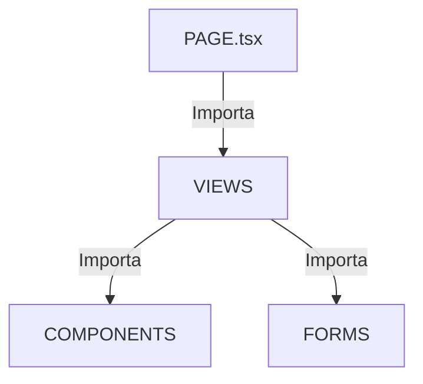

# Sistema de Layout de Páginas

## PageWrapper (Header Integrado)

**Ubicación:** `@/components/layout/page-wrapper`

El sistema de Header es automático dentro de `PageWrapper`. Cuando usas este componente, obtienes automáticamente:
1.  **Título y Subtítulo**.
2.  **Tabs** (opcional) integrados en la parte inferior del header.
3.  **Toolbar** (opcional) integrada en la parte derecha del header.

### Props

| Prop | Valores | Descripción |
|------|---------|-------------|
| `type` | `"page"` / `"dashboard"` | `page` = header estándar; `dashboard` = sin header visual (usado raras veces) |
| `title` | String | Título principal de la página. |
| `description`| String | Descripción opcional debajo del título. |
| `icon` | ReactElement | **OBLIGATORIO**: Debe coincidir con el ícono del sidebar. |
| `tabs` | ReactNode | `TabsList` para navegación entre vistas. |
| `headerToolbar` | ReactNode | **NUEVO**: Componente `<Toolbar>` que se renderiza a la derecha del header. |

---

## Toolbar del Header

**Ubicación:** `@/components/layout/dashboard/shared/toolbar`

La Toolbar es el estándar para acciones, filtros y búsqueda en cualquier página. **NO** crear toolbars ad-hoc dentro del body.

### Props de Toolbar

| Prop | Tipo | Descripción |
|------|------|-------------|
| `portalToHeader` | boolean | Si es `true`, intenta renderizarse en el Header via Portal (usado en vistas). |
| `searchQuery` | string | Estado de búsqueda. |
| `onSearchChange` | function | Setter para el estado de búsqueda. |
| `searchPlaceholder` | string | Placeholder del input de búsqueda. |
| `actions` | Action[] | **OBLIGATORIO** para botones de acción principales (ej. "Crear", "Nuevo"). |
| `leftActions` | ReactNode | Contenido a la izquierda del toolbar (ej: tabs, badges). |
| `filterContent` | ReactNode | Componentes de filtrado custom (ej: `FacetedFilter`). |
| `facetedFilters` | Filter[] | (Solo DataTables) Configuración automática de filtros ligados a una tabla. |

### 🚨 REGLA CRÍTICA: Siempre usar `actions` para botones

> [!CAUTION]
> **NUNCA uses `children` para pasar botones al Toolbar.** Siempre usa la prop `actions`.

El `Toolbar` tiene comportamiento responsive inteligente:
- **Desktop**: Muestra botón rectangular con texto e icono
- **Mobile**: Muestra FAB circular en esquina inferior derecha

Si usas `children` en lugar de `actions`, **pierdes este comportamiento** y el botón se ve inconsistente entre páginas.

#### ❌ INCORRECTO (No hacer esto)
```tsx
<Toolbar portalToHeader>
    <Button onClick={handleCreate}>
        <Plus className="h-4 w-4 mr-2" />
        Nueva Tarea
    </Button>
</Toolbar>
```

#### ✅ CORRECTO (Siempre hacer esto)
```tsx
<Toolbar
    portalToHeader
    actions={[{
        label: "Nueva Tarea",
        icon: Plus,
        onClick: handleCreate,
    }]}
/>
```

#### ✅ CORRECTO - Con múltiples acciones
```tsx
<Toolbar
    portalToHeader
    actions={[
        { label: "Nueva Tarea", icon: Plus, onClick: handleCreate },
        { label: "Importar", icon: Upload, onClick: handleImport },
    ]}
/>
```

### Estructura de ToolbarAction

```typescript
interface ToolbarAction {
    label: string;                           // Texto del botón
    icon: React.ComponentType<{ className?: string }>; // Icono de Lucide
    onClick: () => void;                     // Handler del click
    variant?: 'default' | 'destructive';     // Estilo (opcional)
}
```

---

## Arquitectura de Archivos: Page vs Views

Para mantener el código limpio y organizado, seguimos estrictamente esta jerarquía:



### 1. `page.tsx` (La Página)
- **Solo** define el layout base y el enrutamiento de tabs.
- **NO** contiene lógica de negocio compleja.
- **NO** contiene UI compleja directa.
- Importa las vistas correspondientes.

### 2. `views/` (Las Vistas)
- Ubicación: `src/features/[feature]/views/`
- Son los contenedores de lógica para una pestaña o sección específica.
- Aquí se definen los estados, data fetching y handlers.
- Aquí se usa `<ContentLayout>` y `<Toolbar portalToHeader />`.

---

## 🏆 EJEMPLO MAESTRO (Gold Standard)

Usa este ejemplo como referencia absoluta para nuevas páginas.

### 1. La Página (Page)
**Archivo:** `src/app/[locale]/(dashboard)/organization/contacts/page.tsx`

Observa:
- `generateMetadata` para SEO y Título correcto.
- `try/catch` envolviendo el fetching para evitar pantallas de error gris.
- `<ErrorDisplay>` para manejo de fallos amigable.
- Traducciones con `getTranslations`.
- `PageWrapper` orquestando todo.

```tsx
import { getTranslations } from "next-intl/server";
import { Metadata } from "next";
import { ErrorDisplay } from "@/components/ui/error-display";
import { PageWrapper, ContentLayout } from "@/components/layout";
import { ContactsListView } from "@/features/contact/views/contacts-list-view";
// ... imports

export async function generateMetadata({ params }: { params: { locale: string } }): Promise<Metadata> {
    const t = await getTranslations({ locale: params.locale, namespace: 'Contacts' });
    return {
        title: `${t('title')} | SEENCEL`,
        description: t('subtitle'), // etc...
    };
}

export default async function ContactsPage() {
    const t = await getTranslations('Contacts');

    try {
        const [contacts, types, summary] = await Promise.all([
            // data fetching...
        ]);

        return (
            <Tabs defaultValue="list" className="h-full flex flex-col">
                <PageWrapper
                    type="page"
                    title={t('title')}
                    icon={<Users />}
                    tabs={
                        <TabsList className="bg-transparent p-0 gap-0 h-full flex items-center justify-start">
                            <TabsTrigger value="list">{t('tabs.list')}</TabsTrigger>
                            <TabsTrigger value="settings">{t('tabs.settings')}</TabsTrigger>
                        </TabsList>
                    }
                >
                    <TabsContent value="list" className="m-0 h-full focus-visible:outline-none">
                        <ContentLayout variant="wide">
                            <ContactsListView
                                organizationId={organizationId}
                                initialContacts={contacts}
                                // ... props
                            />
                        </ContentLayout>
                    </TabsContent>
                    
                    {/* Más tabs... */}
                </PageWrapper>
            </Tabs>
        );
    } catch (error) {
        return (
            <div className="h-full w-full flex items-center justify-center">
                <ErrorDisplay
                    title={t('errors.title')}
                    message={error instanceof Error ? error.message : "Unknown error"}
                    retryLabel={t('errors.retry')}
                />
            </div>
        );
    }
}
```

### 2. La Vista (View)
**Archivo:** `src/features/contact/views/contacts-settings-view.tsx` (Ejemplo con Toolbar Portal)

Observa:
- Nombre claro: `FeatureName + View`.
- Ubicación: `src/features/contact/views/`.
- Usa `<Toolbar portalToHeader />` para inyectar controles en el header desde la vista profunda.

```tsx
export function ContactsSettingsView({ organizationId, initialTypes }: ContactsSettingsViewProps) {
    // State y lógica de la vista
    const [searchQuery, setSearchQuery] = useState("");

    return (
        <>
            {/* Toolbar se teletransporta al header automáticamente */}
            <Toolbar
                portalToHeader
                searchQuery={searchQuery}
                onSearchChange={setSearchQuery}
                actions={[
                    { label: "Nuevo", icon: Plus, onClick: handleCreate }
                ]}
            />

            {/* Contenido normal de la vista */}
            <Card>
                {/* ... */}
            </Card>
        </>
    );
}
```

---

## ⚠️ Reglas de Oro (Grabadas a Fuego)

1.  **Toolbar en Header**: NUNCA coloques barras de herramientas, buscadores o filtros dentro del cuerpo de la página (`ContentLayout`). Siempre usa la `Toolbar` inyectada en el header.

2.  **Botones con `actions`**: NUNCA uses `children` para pasar botones al `Toolbar`. SIEMPRE usa la prop `actions={[...]}`. Esto garantiza comportamiento responsive consistente (rectangular en desktop, FAB circular en mobile).

3.  **Jerarquía Sagrada**: `PAGE` > `VIEWS` > `COMPONENTS`. No mezclar. `page.tsx` debe ser legible en un vistazo.

4.  **EmptyState Obligatorio**: Si no hay datos, usa `@/components/ui/empty-state`. Prohibido hacer `divs` vacíos a mano.

5.  **Iconos Consistentes**: El ícono pasado a `PageWrapper` debe ser **idéntico** al usado en el Sidebar.

6.  **Focus Ring**: Los inputs de búsqueda en filtros facetados deben tener `border-none focus:ring-0` para evitar bordes verdes estéticamente incorrectos.

---

## EmptyState: Mejores Prácticas

### 🚨 REGLA CRÍTICA: EmptyState vive en Views, NO en DataTables

> [!CAUTION]
> **NUNCA** coloques lógica de `EmptyState` dentro de componentes `DataTable`. 
> La decisión de mostrar un `EmptyState` vs contenido es responsabilidad de la **View**.

#### ❌ INCORRECTO (No hacer esto)
```tsx
// material-payments-data-table.tsx
export function MaterialPaymentsDataTable({ payments }) {
    if (payments.length === 0) {
        return <EmptyState title="Sin pagos" ... />;  // ❌ MAL
    }
    return <DataTable ... />;
}
```

#### ✅ CORRECTO (Siempre hacer esto)
```tsx
// materials-payments-view.tsx
export function MaterialsPaymentsView({ payments }) {
    if (payments.length === 0) {
        return <EmptyState title="Sin pagos" ... />;  // ✅ BIEN
    }
    return (
        <ContentLayout variant="wide" className="pb-6">
            <MaterialPaymentsDataTable payments={payments} />
        </ContentLayout>
    );
}
```

### TabsContent para EmptyState de altura completa

Para que un `EmptyState` dentro de un `TabsContent` ocupe toda la altura disponible y muestre su borde dashed correctamente, el `TabsContent` **debe** tener estas clases:

```tsx
<TabsContent 
    value="overview" 
    className="m-0 flex-1 h-full flex flex-col focus-visible:outline-none"
>
    <MaterialsOverviewView ... />
</TabsContent>
```

| Clase | Propósito |
|-------|-----------|
| `m-0` | Elimina márgenes por defecto de Radix |
| `flex-1` | Permite que crezca para ocupar espacio disponible |
| `h-full` | Altura 100% del contenedor padre |
| `flex flex-col` | Permite que hijos se expandan verticalmente |
| `focus-visible:outline-none` | Elimina outline de accesibilidad innecesario |

### ContentLayout con EmptyState

Cuando una View muestra `EmptyState`, envuélvelo en `ContentLayout` para padding consistente:

```tsx
export function MaterialsOverviewView({ hasMaterials }) {
    if (!hasMaterials) {
        return (
            <ContentLayout variant="wide" className="pb-6">
                <EmptyState
                    title="Sin materiales"
                    description="Agrega materiales para comenzar"
                    icon={Package}
                />
            </ContentLayout>
        );
    }
    // ... contenido normal
}
```

---

## Checklist de Desarrollo

- [ ] ¿`page.tsx` sigue el ejemplo `ContactsPage`?
- [ ] ¿`views` están en `features/[name]/views`?
- [ ] ¿Usas `PageWrapper` con `icon` correcto?
- [ ] ¿Usas `Toolbar` con `portalToHeader` para acciones y filtros?
- [ ] ¿Los botones de acción usan `actions={[...]}` y NO `children`?
- [ ] ¿El contenido está dentro de `ContentLayout`?
- [ ] ¿Hay `EmptyState` si la lista está vacía?
- [ ] ¿El `EmptyState` está en la **View**, no en DataTable u otros componentes anidados?
- [ ] ¿Los `TabsContent` tienen `className="m-0 flex-1 h-full flex flex-col focus-visible:outline-none"`?
